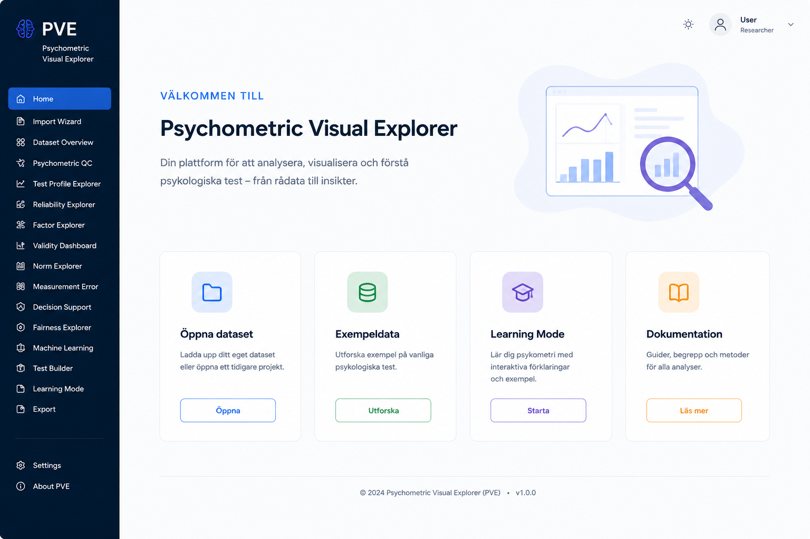
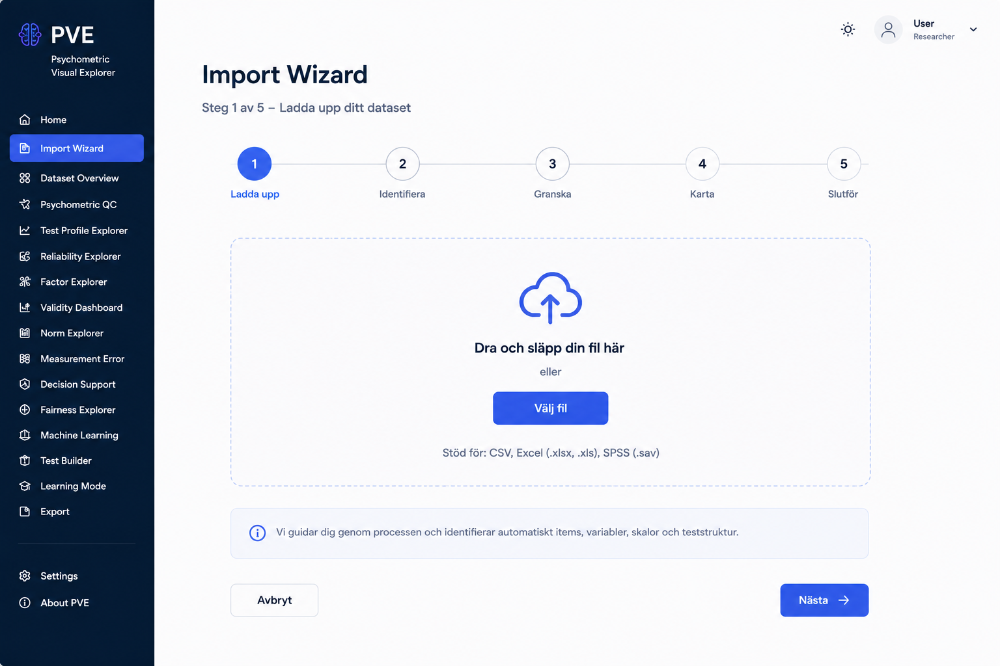
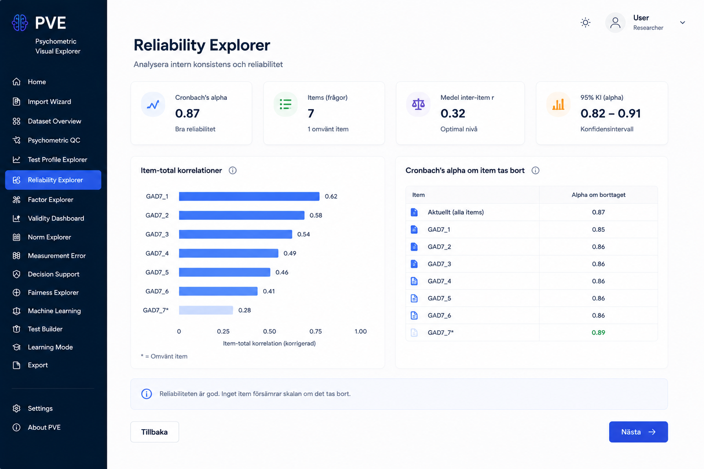
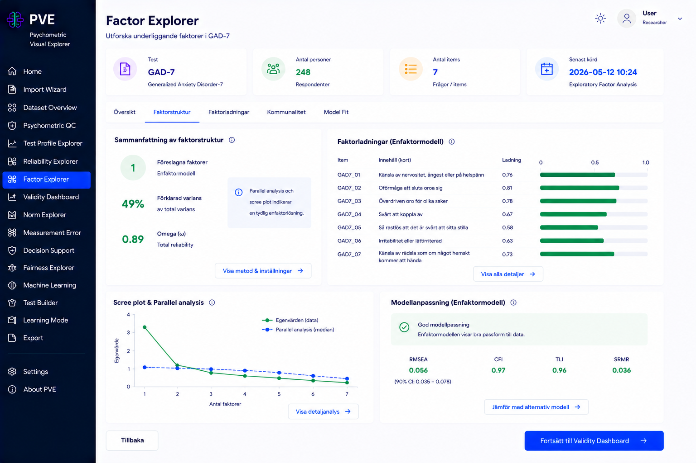
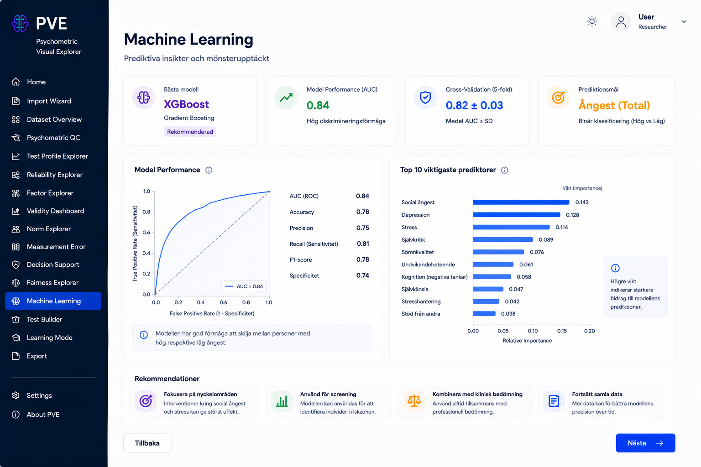

# Psychometric Visual Explorer (PVE)

**Interactive Machine Learning and Psychometric Analysis Platform**

PVE is a Streamlit application that walks a psychologist, researcher, or
student through the full psychometric workflow — from raw questionnaire data
to a published, exportable report — for any Likert-style test, not just the
handful shipped with it.

## What it is and who it's for

Psychometric analysis normally means stitching together SPSS, R, and a
handwritten report. PVE is a single, visual, guided alternative: import a
dataset (or start from a built-in example), and walk through data quality,
reliability, factor structure, validity, norms, measurement error, decision
support, fairness, and machine learning, with every statistic explained in
plain language alongside the number. It was built as:

- **An Applied AI course submission** — the Machine Learning Explorer module
  implements a full pipeline (data prep, unsupervised learning, a non-linear
  supervised model, a deep-learning option, cross-validation, and a full
  evaluation suite with SHAP-based feature importance) against a real
  psychometric dataset.
- **A psychometrics study aid** — a Läroläge (Learning Mode) toggle in the
  sidebar reveals a deeper, plain-language explanation of the underlying
  concept, formula, and worked example on any ⓘ info icon, right where the
  statistic is shown.
- **A portfolio piece** demonstrating a clean separation between statistical
  logic, visualization, and UI in a non-trivial Streamlit application.
- **A genuinely usable tool** for exploring the reliability, structure, and
  predictive value of a psychological questionnaire.

Three example tests ship out of the box — **GAD-7** (anxiety, N≈2450),
**PHQ-9** (depression, N≈250), and **IPIP Big Five** (personality, N≈250) —
with synthetic but psychometrically plausible data. New tests can be defined
without writing code, either by hand-authoring a JSON plugin or through the
in-app **Test Builder**.

## Features

| Module | What it does |
|---|---|
| **Import Wizard** | 2-step flow: upload → review. Auto-detects a known test from column names or falls back to manual mapping. |
| **Dataset Overview** | N, response distributions, missingness, demographics, descriptive statistics, a reliability snapshot, and a test-profile section (item/subscale structure, item correlation heatmap). |
| **Psychometric QC** | Automated checks: floor/ceiling effects, low-variance/constant items, outliers, duplicates, straight-lining patterns, an overall quality score. |
| **Reliability Explorer** | Cronbach's alpha, McDonald's omega, item-total correlations, alpha-if-item-deleted, split-half, test-retest. |
| **Factor Explorer** | Exploratory factor analysis: scree plot + parallel analysis, loadings, communalities, model fit (RMSEA/CFI/TLI/SRMR), factor correlations. |
| **Validity Dashboard** | The five AERA/APA/NCME evidence sources — content, response processes, internal structure, relations to other variables, consequences. |
| **Norm Explorer** | Raw → Z → T-score → percentile → stanine conversion, normal-curve visualization. |
| **Measurement Error** | SEM, 95% confidence intervals per person, reliable change index. |
| **Decision Support** | ROC curve, AUC, confusion matrix at a selectable threshold, sensitivity/specificity/PPV/NPV across cut scores, Youden's J. |
| **Fairness Explorer** | Group comparisons (age/gender/education/group) via Cohen's d, a fairness index, DIF/measurement-invariance framing. |
| **Machine Learning Explorer** | KMeans + PCA, Random Forest / XGBoost / a small PyTorch MLP, cross-validation, full evaluation suite, SHAP feature importance, a single-respondent prediction tool. |
| **Test Builder** | View, edit, duplicate, or build from scratch a test definition (items, scales, response options, cut-offs) and save it as a new plugin. |
| **Export** | PDF reports (complete analysis, psychometric summary, decision support), PNG figure bundles, and anonymized CSV data export — as individual files or a combined ZIP. |

## Technology stack

- **Python 3.12**, **Streamlit** (UI + multi-page navigation)
- **Pandas** / **NumPy** / **SciPy** — data handling and statistics
- **Pingouin** / **factor_analyzer** — reliability and factor analysis
- **scikit-learn**, **XGBoost**, **PyTorch**, **SHAP** — machine learning
- **Plotly** — all interactive charts
- **Pydantic** — the plugin (test-definition) schema
- **ReportLab**, **Kaleido** — PDF report and PNG figure export
- **pytest** — unit tests for every `core/` engine

## Installation

```bash
git clone https://github.com/<your-username>/psychometric-visual-explorer.git
cd psychometric-visual-explorer
python -m venv .venv
.venv\Scripts\activate      # Windows — use "source .venv/bin/activate" on macOS/Linux
pip install -r requirements.txt
streamlit run app.py
```

The app opens with three example datasets available directly from the Import
Wizard ("Exempeldata") — no external data required to try it out.

## Deployment (Streamlit Community Cloud)

The repository is deploy-ready as-is — no secrets or environment variables
are required.

1. Push this repo to GitHub (already done if you're reading this on GitHub).
2. Go to [share.streamlit.io](https://share.streamlit.io) and sign in with
   GitHub.
3. Click **New app**, pick this repo/branch, and set the main file path to
   `app.py`.
4. Deploy. You'll get a public URL like
   `https://<app-name>.streamlit.app`.

`packages.txt` (system libraries for Kaleido's headless-Chromium PDF/PNG
export) and `.python-version` are already included, so the build should
succeed without extra configuration. Note that **Test Builder writes new
plugin files to disk during a session** — on Community Cloud that storage is
ephemeral, so custom plugins won't survive an app reboot/redeploy (everything
else works normally). If the initial build is slow or runs out of space, the
first thing to try is pinning `torch` to a CPU-only wheel via
`--extra-index-url https://download.pytorch.org/whl/cpu`, since PyPI's
default Linux `torch` wheel bundles CUDA dependencies that aren't needed here.

## Repository structure

```
psychometric-visual-explorer/
├── app.py                # Entry point: page navigation, theming, Home page
├── core/                 # Pure logic — no Streamlit imports, unit-tested
│   ├── data_model.py       # Dataset / Questionnaire / Statistics objects
│   ├── import_engine.py    # File parsing, column identification
│   ├── plugin_engine.py    # Plugin load/match/save (Test Builder logic)
│   ├── stats_engine.py     # Reliability, factor analysis, validity, norms,
│   │                        # measurement error, decision support, fairness
│   ├── ml_engine.py         # The full ML pipeline
│   ├── viz_engine.py        # Plotly figure builders (no calculations)
│   └── export_engine.py     # PDF/PNG/CSV export, shared by every page
├── pages/                 # One Streamlit page per module (rendering only)
├── plugins/                # JSON test definitions (no executable code)
├── components/             # Shared UI widgets (KPI cards, tooltips, export)
├── utils/                   # Session helpers, theming, Läroläge deep-dive content
├── data/sample_datasets/    # Generated synthetic CSVs (committed)
├── tests/                   # pytest — one file per core/ engine
└── docs/                    # Build plan, mockups, reference material
```

## Example workflow

```
Import Dataset → Quality Control → Reliability → Factor Analysis →
Validity / Norms / Decision Support → Machine Learning → Export Report
```

Every page reads the same active `Questionnaire` + `Dataset` pair from
session state, so the exact same code path renders GAD-7, PHQ-9, and Big
Five — there is no per-test page logic anywhere in `pages/`.

## Screenshots

*(Design reference — the shipped UI follows these mockups; see `docs/mockups/` for the full set across all three example tests.)*

| Home | Import Wizard |
|---|---|
|  |  |

| Reliability Explorer | Factor Explorer |
|---|---|
|  |  |

| Machine Learning Explorer |
|---|
|  |

## License

Released under the [MIT License](LICENSE).

## Future development

- Additional plugins: PANAS, PSS, SSP
- Confirmatory factor analysis (CFA) alongside the current EFA
- Real DIF / measurement-invariance testing (currently framed but not computed)
- Persistent storage for custom plugins created in Test Builder (currently session/ephemeral on cloud deployments)
